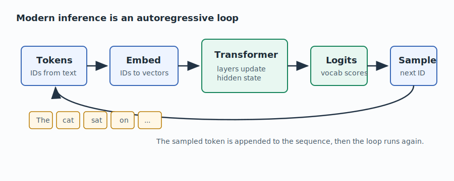
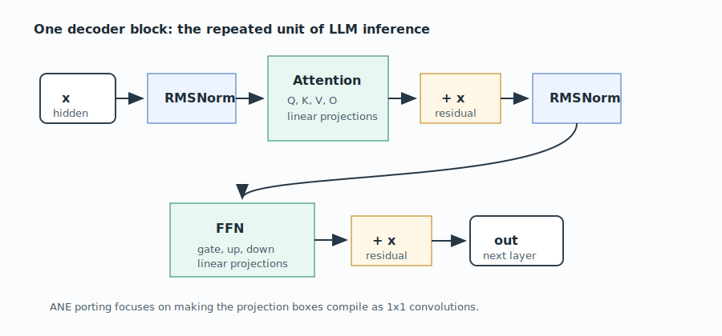
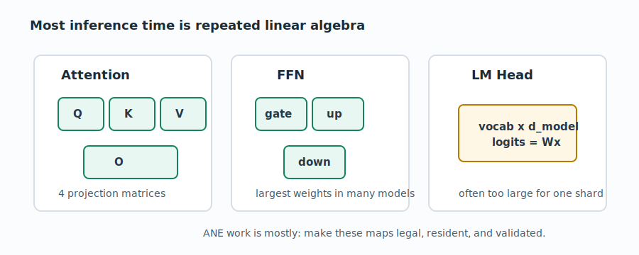
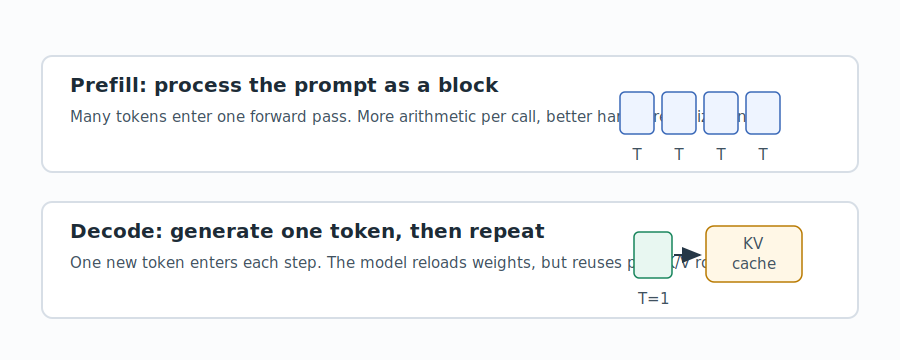
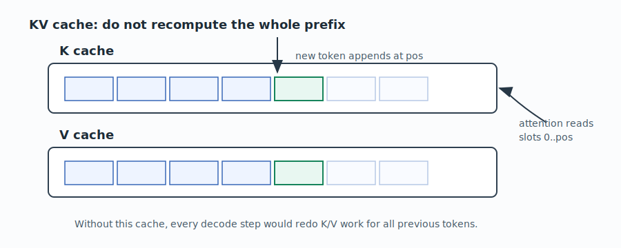
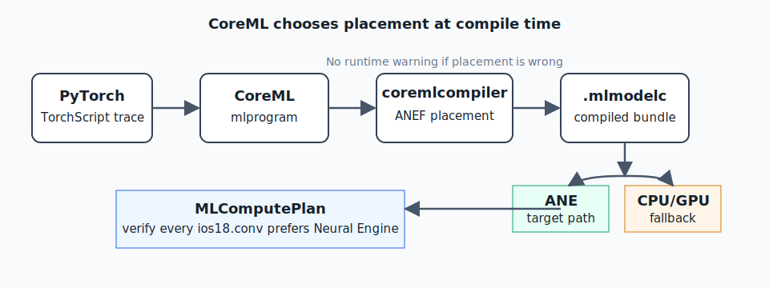
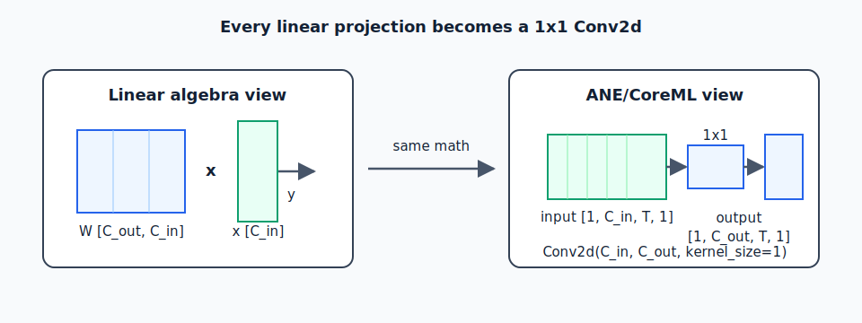

# Chapter 0 — Modern LLM Inference on Apple Silicon

Before the Apple Neural Engine matters, the inference loop has to make sense.
This chapter starts from a normal decoder-only LLM, then shows why running that
loop on Apple Silicon pushes us toward CoreML, 1x1 convolutions, KV state, and
small validated shards.

## What Modern LLM Inference Is

An LLM does not generate a whole answer at once. It repeatedly predicts the next
token.

The host starts with text, tokenizes it into integer IDs, looks up embeddings for
those IDs, runs a stack of transformer layers, projects the final hidden state to
vocabulary logits, samples one token, appends that token to the sequence, and
runs the loop again.



The generated text is just the visible surface. The actual hot path is the
repeated update of a hidden vector through dozens of layers. Each new token pays
for another trip through the model.

In a decoder-only transformer, the repeated unit looks like this:



A few terms show up everywhere in this book:

- **Token**: an integer ID representing a text fragment.
- **Embedding**: the vector looked up for a token ID.
- **Hidden state**: the vector representation carried between layers.
- **Logits**: one score per vocabulary token; sampling chooses the next token
  from these scores.
- **Projection**: a learned linear map, usually written \(y = Wx\).

The important engineering fact is that most transformer work is not mysterious.
It is the same linear algebra repeated in attention, feed-forward networks, and
the language-model head.



That is why an inference runtime is mostly a hardware-placement problem: make
the projection-heavy loop run on the fastest viable engine, keep data movement
small, and prove the result still matches a reference model.

## Prefill vs Decode

Modern inference has two different phases.

**Prefill** processes the user's prompt. If the prompt has 512 tokens, the model
can process many of those tokens in a single block-shaped forward pass. This is
more like matrix-matrix work and tends to use the hardware well.

**Decode** generates new tokens. It is sequential: token 37 cannot be generated
until token 36 is known. Decode is usually memory-bandwidth bound because every
new token reloads large weight matrices to update one hidden vector.



This distinction explains many later design choices:

- `T=1` is the common decode shape: one new token per model call.
- `T>1` is useful for prefill and speculative verification.
- RangeDim exists because one compiled model may need to accept both `T=1` and
  small `T>1` inputs.
- Throughput numbers are only meaningful when you know whether they measure
  prefill, decode, or an end-to-end mix.

## Why KV Cache Exists

Attention lets each token read earlier tokens. Without a cache, every decode step
would recompute keys and values for the whole prefix. That is wasteful: most of
the prefix did not change.

A KV cache stores the past key and value rows. During decode, the model computes
the new token's K/V rows, writes them at the current position, and attention
reads the prefix already stored in the cache.



On GPU and CPU runtimes, this cache is usually host-managed memory passed into
kernels. On CoreML, the public mechanism is `MLState`: state tensors owned by the
model runtime and reused across `prediction()` calls. Chapter 5 is about making
that stateful loop work on ANE.

## The Hardware Problem

Once the inference loop is clear, the hardware problem becomes concrete:

1. The model is mostly projection matrices.
2. Decode uses those matrices one token at a time.
3. The KV cache keeps attention from recomputing the whole prefix.
4. The runtime must keep the hot projections and cache operations on the intended
   accelerator.

CPU, GPU, and ANE are three answers to the same question: where does this loop
run, and at what power cost?

## The Hardware You're Not Using

Every Apple Silicon Mac and iPhone ships with an Apple Neural Engine. On an M4 Max
it has 38 TOPS of throughput, runs at a fraction of the power of the GPU, and is
sitting idle while llama.cpp burns CPU and Metal burns battery.

The reason nobody uses it directly is that Apple doesn't document it. There is no
ANE SDK. The only official path is CoreML — and CoreML's documentation is written
for app developers who want to run Vision models, not for researchers who want to
run 8-billion-parameter MoE transformers at 9 tok/s.

This book documents what it takes to get real LLMs running on the ANE, based on
35+ experiments across five model families.

## ANE vs GPU vs CPU — the Real Tradeoffs {#ane-vs-gpu-vs-cpu--the-real-tradeoffs}

| Property | ANE | GPU (Metal) | CPU |
|----------|-----|-------------|-----|
| Peak compute | 38 TOPS (M4 Max) | ~14 TFLOPS fp16 | ~1 TFLOPS |
| Power at load | ~2–4W | ~10–20W | ~8–15W |
| Memory bandwidth | On-chip SRAM + UMA | UMA (shared) | UMA |
| Latency per op | Low (fixed-function) | Higher (shader launch) | High |
| Programmability | CoreML only | Metal Shaders | Anything |
| INT8 native | Yes | Yes (via Metal) | Yes |
| Stateful cache | Yes (MLState) | Manual | Manual |

The ANE wins on power-per-token. At decode speed, the limiting factor is memory
bandwidth (loading weights per token), and the ANE's fixed-function conv engines
are faster per watt at `y = Wx` (the dominant operation in every LLM) than a
general-purpose shader grid.

**The catch**: the ANE only runs what CoreML lets through. And CoreML is picky.

## What CoreML Actually Does

CoreML is a compiler that takes a PyTorch or TorchScript model and emits an
`.mlpackage`. When you call `xcrun coremlcompiler compile`, it produces an
`.mlmodelc` directory with:



- `model.espresso.net` — the network graph as a flatbuffer
- `model.espresso.shape` — tensor shape metadata
- `*.mlmodelc/Data/com.apple.CoreML/weights/` — quantized weight blobs

At runtime, the CoreML framework dispatches ops to one of three backends:
- **ANE** — Apple Neural Engine (fastest for conv/matmul, stateful)
- **GPU** — Metal Performance Shaders
- **CPU** — Accelerate/vDSP

The dispatch decision is made by the **ANE compiler (ANEF)** during `.mlmodelc`
compilation, not at runtime. You can inspect it with `MLComputePlan` —
the ground-truth source of whether your ops land on ANE or not.

## Why Every Matmul Must Be Conv2d

The ANE's primary instruction is a **2D convolution**. The GPU has general
matrix-multiply (GEMM) shaders. The ANE does not have a standalone GEMM.

The trick: a 1×1 convolution over a `[1, C_in, T, 1]` input with a
`[C_out, C_in, 1, 1]` kernel is mathematically identical to `y = Wx` with
`W` being `[C_out, C_in]`.



```python
# This is how every LLM linear projection becomes ANE-native:
self.proj = nn.Conv2d(d_in, d_out, kernel_size=1, bias=False)
# input:  [batch=1, d_in, seq_len, 1]
# output: [batch=1, d_out, seq_len, 1]
```

This is the single most important fact in this book. If you don't reshape
everything to `[1, channels, T, 1]` and use `Conv2d(1×1)`, nothing lands on ANE.

## What This Book Covers

- **Chapter 1** — ANE empirical laws (shape, residency, shard limits, verified rules)
- **Chapter 2** — Porting recipe (GGUF → CoreML, step by step)
- **Chapter 3** — Quantization (INT8 production, INT4 tradeoffs, the silent CPU fallback)
- **Chapter 4** — Shard sizing (layer count vs size, the 250 MB cliff, LM-head splits)
- **Chapter 5** — Stateful KV cache (MLState, the Swift daemon design)
- **Chapter 6** — RangeDim and speculative decode (T=1..4, n-gram acceptance)
- **Chapter 7** — MoE on ANE (soft routing, per-expert dispatch, ZAYA)
- **Chapter 8** — Experiment index (all experiments, what worked and why)
- **Chapter 9** — Decision journal (the thinking behind the hard calls)
- **Glossary** — short definitions for inference, CoreML, ANE, and validation terms
