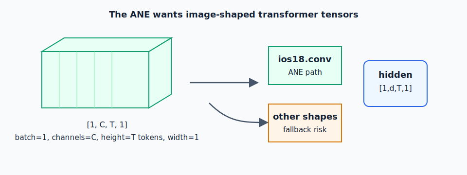
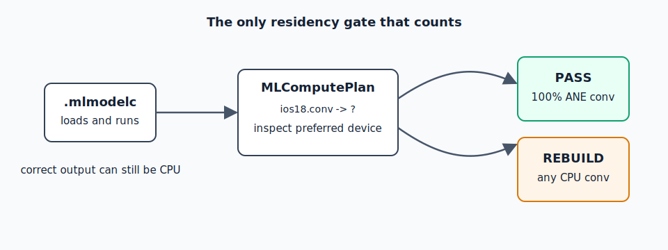

# Chapter 1 — ANE Empirical Laws

**Source**: black-box CoreML placement experiments on macOS (M4 Max, h16g,
16 ANE cores), `MLComputePlan` residency checks, and 35+ real-model conversion
experiments.

An empirical law is a rule learned from the compiler and hardware, not from an
API promise. In normal inference engineering you can often change tensor layout,
quantization, or model packaging and still get a working graph. On ANE, those
choices decide whether the graph runs on the Neural Engine or silently falls back
to CPU.

Read this chapter as the boundary between the generic inference loop from
Chapter 0 and the concrete CoreML implementation. The laws say which shapes,
operators, quantization formats, and package sizes survived real placement checks.

These are ground-truth rules, not speculation. Each one was verified with
`MLComputePlan` placement checks or runtime measurement.

---

## Law 1: The Shape Must Be `[1, channels, T, 1]`

Every input and output tensor in an ANE-bound model must have 4 dimensions with
the batch dimension = 1, spatial height = T (sequence length), spatial width = 1.

```
[batch, channels, height, width] → [1, C, T, 1]
```



This is because the ANE's primary op is `ios18.conv`, which operates on 4D
tensors. Any op that doesn't fit this shape will fall through to GPU or CPU.

**Consequence**: every reshape, transpose, and layer normalization in your model
must maintain this convention. Hidden states travel as `[1, d_model, T, 1]`.
Attention heads are split as `[1, d_head, T, 1]` per head (or packed as
`[1, n_heads * d_head, T, 1]` and split with slice ops).

---

## Law 2: Use `ios18.conv` for Every Projection

In CoreML MIL (Model Intermediate Language), the ANE-native matmul op is
`ios18.conv`. You must target `mlprogram` format with `minimum_deployment_target`
set to iOS 18 / macOS 15 or later to get this op class.

```python
import coremltools as ct

model = ct.convert(
    traced_model,
    convert_to="mlprogram",
    minimum_deployment_target=ct.target.macOS15,  # or iOS18
    compute_units=ct.ComputeUnit.CPU_AND_NE,
)
```

`CPU_AND_NE` (not `ALL`) is the right compute unit. `ALL` allows GPU fallback that
can silently run ops on Metal instead of ANE. With `CPU_AND_NE`, only CPU and ANE
are in scope — and the ANE compiler will take everything it can.

---

## Law 3: INT8 Per-Tensor Is the Production Baseline

INT8 per-tensor quantization (`coremltools.optimize.coreml.linear_quantize_weights`
with `dtype=int8, granularity="per_tensor"`) is validated to keep all `ios18.conv`
ops on ANE in all tested shard configurations.

```python
op_config = ct.optimize.coreml.OpLinearQuantizerConfig(
    dtype=ct.optimize.coreml.QuantizationDtype.int8,
    granularity="per_tensor",
)
```

**Critical**: `granularity="per_block"` (linear INT4 per-block) causes every conv
op to fall off ANE to CPU in small shards. See Chapter 3 for the full details.

---

## Law 4: The Shard Size Ceiling Is ~250 MB

A single `.mlpackage` that compiles and stays fully ANE-resident has an empirical
upper limit of approximately **250 MB** of model weights. The validated ceiling is
223 MB (a 3-layer Phi-4-mini shard). Beyond ~250 MB, the ANEF compiler emits
error -14 at compile time.

```
< 250 MB  → compiles, ANE-resident, validated
~223 MB   → validated ceiling (3-layer Phi-4-mini, INT8)
> ~1 GB   → hard ANEF error -14 (no ANE at any quantization)
```

This limit is a compiler constraint, not a runtime memory limit. It implies that
models larger than ~2B parameters require sharding.

---

## Law 5: Every Layer Must Be Its Own Shard (For Large Models)

Given the 250 MB ceiling, large models (7B+) typically need 1–3 transformer
layers per shard. The optimal packing is determined empirically:

| Model | Params | Layers total | Layers/shard | Shards |
|-------|--------|-------------|--------------|--------|
| Phi-4-mini | 3.8B | 32 | 3 | ~11 |
| ZAYA1-8B MoE | 8B | 28 | 1 MoE layer | 28+ |
| Gemma-4-26B | 26B | 30 | 1 | 30+ |

For models with large embedding tables or LM heads, those must be split
separately — see Chapter 4.

---

## Law 6: MLComputePlan Is the Ground Truth

Do not trust compilation success as evidence of ANE placement. The model can
compile, load, and produce correct output — entirely on CPU — with no error or
warning.

**The only reliable residency check is `MLComputePlan`**:



```swift
let plan = try await MLComputePlan.load(contentsOf: modelURL, configuration: config)
for (op, info) in plan.modelStructure.program.functions["main"]!.block.operations {
    let preferred = plan.computeDeviceUsage(for: op)?.preferredComputeDevice
    // check preferred == .neuralEngine
}
```

Or in Python with coremltools:

```python
import coremltools as ct
model = ct.models.MLModel("shard.mlpackage", compute_units=ct.ComputeUnit.CPU_AND_NE)
plan = model._get_compute_plan()
# inspect plan for non-ANE ops
```

ANE residency gate: all `ios18.conv` ops must show `preferredComputeDevice == .neuralEngine`.
Any CPU-scheduled `ios18.conv` is a fail — rebuild the shard.

---

## Law 7: Host Round Trips Are Part of the Model

Large LLM ports are not just tensor graphs. They are also runtime systems. Every
time Swift calls into a separate CoreML shard, the host has to package inputs,
enter the CoreML runtime, synchronize outputs, and hand the next shard its input.
If the shards are too tiny, that orchestration cost becomes part of the model's
latency.

The public lesson is to keep device-local work coarse enough to amortize the
call boundary:

- Pack as many layers into a shard as the ANE compiler will accept.
- Keep intermediate activations in CoreML-managed tensors whenever possible.
- Use `MLState` for decode cache instead of copying KV tensors through Swift.
- Preallocate host buffers, masks, and feature objects in the runtime hot path.
- Treat multi-function CoreML models as the public direction for future
    procedure-style dispatch.

This is the dispatch version of the shard-size law: a shard has to be small
enough to compile, but large enough that the host does not dominate decode.

---

## Law 8: Stateful KV Cache Requires MLState

For autoregressive decode (T=1), KV caches must be stored in `MLState` —
CoreML's stateful tensor mechanism. This avoids re-passing the KV prefix on
every decode step.

The pattern:
1. Convert the model with `ct.StateType` inputs/outputs for keys and values.
2. Allocate one `MLState` object per active sequence.
3. At decode, call `model.predict(input, using: state)`.

Without MLState, each decode step copies the entire KV prefix in and out of
CoreML — O(seq_len) memory per step.

See Chapter 5 for the full MLState design.

---

## Summary Table

| Law | Rule |
|-----|------|
| Shape | `[1, C, T, 1]` for all tensors |
| Op | `ios18.conv` for all projections |
| Quant | INT8 per-tensor for production |
| Shard size | ≤250 MB per `.mlpackage` |
| Sharding | 1–3 layers/shard for 7B+ models |
| Residency check | `MLComputePlan` only (not compile success) |
| Multi-stage | Coarse shards and CoreML-managed state to reduce host round trips |
| Decode cache | `MLState` for KV cache |
