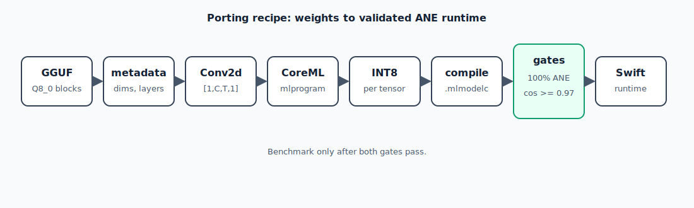

# Chapter 2 — Porting Recipe: GGUF to CoreML ANE

This chapter walks you through converting a model from GGUF to a set of
ANE-resident CoreML shards, from scratch. We use Qwen 2.5 as the worked example
but the pattern applies to any dense transformer.



## Prerequisites

- macOS 15+ (Sequoia), Apple Silicon Mac
- Xcode 16+ (the bundled `python3` has coremltools 9)
- A GGUF file from Hugging Face (`.Q8_0.gguf` recommended)

**Three Python environments, never mixed**:

| Env | Use case | Activate |
|-----|----------|---------|
| `.venv` | PyTorch, training, golden capture | `source .venv/bin/activate` |
| `.venv313` | HuggingFace / transformers | `source .venv313/bin/activate` |
| Xcode `python3` | coremltools 9, CoreML conversion | `/usr/bin/python3` (Xcode) |

Never run coremltools from `.venv` or `.venv313` — they have coremltools 8 or
older. Conversion must use Xcode's `python3`.

---

## Step 0: Read the GGUF and Extract Metadata

```python
# converters/gguf_to_ane.py (the generic converter)
from gguf import GGUFReader

reader = GGUFReader("model.Q8_0.gguf")
arch = reader.fields["general.architecture"].data[0]  # e.g. "qwen2"
n_layers = int(reader.fields[f"{arch}.block_count"].data[0])
d_model = int(reader.fields[f"{arch}.embedding_length"].data[0])
n_heads = int(reader.fields[f"{arch}.attention.head_count"].data[0])
n_kv_heads = int(reader.fields[f"{arch}.attention.head_count_kv"].data[0])
n_ff = int(reader.fields[f"{arch}.feed_forward_length"].data[0])
vocab_size = int(reader.fields[f"{arch}.vocab_size"].data[0])
```

GGUF quantized weights are stored as `Q8_0` blocks (32 values per block, each
block has a float16 scale). You must dequantize to float32 before building the
CoreML graph.

---

## Step 1: Build the Conv2d Model Graph

The key insight (Chapter 0): every `nn.Linear` becomes `nn.Conv2d(in, out, 1×1)`.
Reshape input from `[T, d]` → `[1, d, T, 1]` at the start, back at the end.

```python
import torch
import torch.nn as nn

class ANETransformerLayer(nn.Module):
    def __init__(self, d_model, n_heads, n_kv_heads, d_ff, d_head):
        super().__init__()
        # All projections as 1x1 Conv2d
        self.q_proj = nn.Conv2d(d_model, n_heads * d_head, 1, bias=False)
        self.k_proj = nn.Conv2d(d_model, n_kv_heads * d_head, 1, bias=False)
        self.v_proj = nn.Conv2d(d_model, n_kv_heads * d_head, 1, bias=False)
        self.o_proj = nn.Conv2d(n_heads * d_head, d_model, 1, bias=False)
        # FFN
        self.gate_proj = nn.Conv2d(d_model, d_ff, 1, bias=False)
        self.up_proj   = nn.Conv2d(d_model, d_ff, 1, bias=False)
        self.down_proj = nn.Conv2d(d_ff, d_model, 1, bias=False)
        # Norms
        self.norm1 = RMSNorm(d_model)
        self.norm2 = RMSNorm(d_model)

    def forward(self, x):
        # x: [1, d_model, T, 1]
        h = self.norm1(x)
        # Attention (simplified, non-stateful for illustration)
        q = self.q_proj(h)  # [1, n_heads*d_head, T, 1]
        k = self.k_proj(h)
        v = self.v_proj(h)
        # ... reshape, RoPE, attention, o_proj ...
        x = x + attn_out
        h = self.norm2(x)
        gate = torch.nn.functional.silu(self.gate_proj(h))
        up   = self.up_proj(h)
        x    = x + self.down_proj(gate * up)
        return x
```

---

## Step 2: Load Weights from GGUF

```python
def load_layer_weights(reader, layer_idx, model):
    """Dequantize GGUF Q8_0 weights and load into Conv2d model."""
    prefix = f"blk.{layer_idx}"
    for name, param in model.named_parameters():
        gguf_key = gguf_key_map(prefix, name)  # map conv weight names → GGUF keys
        tensor = reader.tensors[gguf_key]
        weights_f32 = dequantize_q8_0(tensor)   # float32
        # Conv2d weight shape: [out, in, 1, 1]
        param.data = torch.from_numpy(weights_f32).reshape(param.shape)
```

Q8_0 dequantization: each block of 32 values has a float16 scale.

```python
import numpy as np

def dequantize_q8_0(tensor):
    data = tensor.data  # raw bytes
    n_blocks = len(data) // 34  # 2 bytes scale + 32 bytes ints
    data = data.reshape(n_blocks, 34)
    scales = data[:, :2].view(dtype=np.float16).reshape(-1, 1).astype(np.float32)
    ints   = data[:, 2:].astype(np.int8).astype(np.float32)
    return (ints * scales).reshape(-1)
```

---

## Step 3: Trace and Convert to CoreML

```python
import coremltools as ct

# Trace with example input (T=1 for decode, T=4 for RangeDim)
example_input = torch.zeros(1, d_model, 4, 1)
traced = torch.jit.trace(layer_model.eval(), example_input)

# Convert to CoreML mlprogram targeting ANE
coreml_model = ct.convert(
    traced,
    inputs=[ct.TensorType(name="hidden", shape=[1, d_model, ct.RangeDim(1, 4), 1])],
    outputs=[ct.TensorType(name="out_hidden")],
    convert_to="mlprogram",
    minimum_deployment_target=ct.target.macOS15,
    compute_units=ct.ComputeUnit.CPU_AND_NE,
)
```

`ct.RangeDim(1, 4)` tells CoreML the sequence dimension T can be 1–4 at runtime.
This enables speculative decode (Chapter 6) without recompiling.

---

## Step 4: Apply INT8 Quantization

```python
op_config = ct.optimize.coreml.OpLinearQuantizerConfig(
    dtype=ct.optimize.coreml.QuantizationDtype.int8,
    granularity="per_tensor",  # NOT per_block — see Chapter 3
)
config = ct.optimize.coreml.OptimizationConfig(
    global_config=op_config,
)
quantized = ct.optimize.coreml.linear_quantize_weights(coreml_model, config=config)
```

---

## Step 5: Save and Compile

```python
quantized.save("shard_layer_0.mlpackage")
```

```bash
# Compile using Xcode's coremlcompiler (requires absolute paths)
SHARD="$PWD/shard_layer_0.mlpackage"
OUT="$PWD/shard_layer_0.mlmodelc"
xcrun coremlcompiler compile "$SHARD" "$(dirname $OUT)"
```

---

## Step 6: Verify ANE Residency

```swift
// Swift residency check
import CoreML

let config = MLModelConfiguration()
config.computeUnits = .cpuAndNeuralEngine

let modelURL = URL(fileURLWithPath: "shard_layer_0.mlmodelc")
let plan = try await MLComputePlan.load(contentsOf: modelURL, configuration: config)

var convOnANE = 0
var convTotal = 0
for op in plan.modelStructure.program!.functions["main"]!.block.operations {
    if op.operator.name.hasPrefix("conv") {
        convTotal += 1
        if plan.computeDeviceUsage(for: op)?.preferredComputeDevice == .neuralEngine {
            convOnANE += 1
        }
    }
}
print("Conv on ANE: \(convOnANE)/\(convTotal)")
// Must be 100% — any failure is a rebuild
```

---

## Step 7: Capture a Golden for Quality Validation

Before benchmarking, capture reference logits from PyTorch FP16 and verify cosine
similarity ≥ 0.97 vs your CoreML output.

```python
# golden capture (in .venv with PyTorch)
import torch, numpy as np
model_pt = load_pytorch_model(layer_idx=0)
with torch.no_grad():
    out_pt = model_pt(torch.randn(1, d_model, 1, 1).half()).float().numpy()
np.save("golden_layer_0.npy", out_pt)

# quality check (after CoreML run)
out_coreml = run_coreml_shard("shard_layer_0.mlmodelc", ...)
cos = np.dot(out_pt.ravel(), out_coreml.ravel()) / (
    np.linalg.norm(out_pt.ravel()) * np.linalg.norm(out_coreml.ravel())
)
print(f"cos={cos:.6f}")  # Must be ≥ 0.97, typically ≥ 0.999 for INT8
```

---

## Summary Checklist

```
[ ] Model uses Conv2d(1×1) for all projections
[ ] Input shape is [1, d_model, T, 1]
[ ] Conversion uses Xcode python3 with coremltools 9
[ ] minimum_deployment_target = macOS15 / iOS18
[ ] compute_units = CPU_AND_NE
[ ] INT8 per-tensor quantization applied
[ ] .mlpackage compiled with xcrun coremlcompiler
[ ] MLComputePlan check: 100% conv ops on ANE
[ ] Golden cosine ≥ 0.97 before any benchmarking
```
