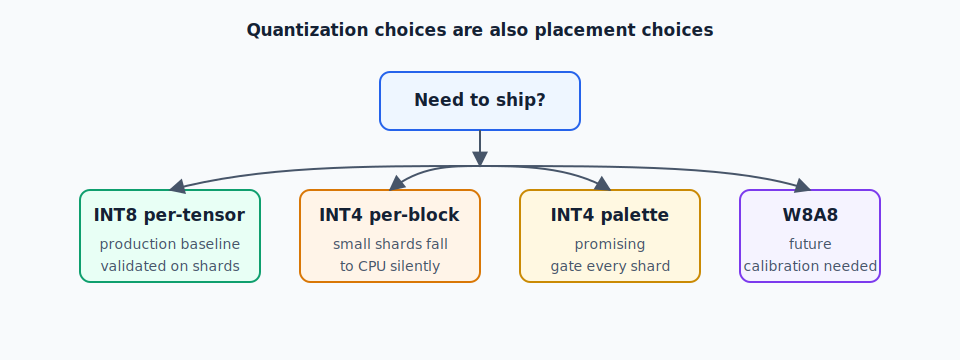

# Chapter 3 — Quantization on ANE

## The Only Safe Baseline: INT8 Per-Tensor

After 35+ experiments across five model families, the only quantization format
validated to keep all `ios18.conv` ops on ANE across all shard sizes is:

> **INT8 per-tensor weight quantization** (`granularity="per_tensor"`)

Everything else either degrades quality, silently falls to CPU, or both.



---

## The INT4 Per-Block Silent CPU Fallback

This is the most dangerous failure mode in ANE development: your model compiles,
loads, produces correct output — but runs entirely on CPU. No error. No warning.

**Reproduction**: Apply `constexpr_blockwise_shift_scale` (linear INT4 per-block)
to any small shard (2–8 transformer layers). Run `MLComputePlan`. Every
`ios18.conv` will show `preferredComputeDevice == .cpu`.

Measured evidence:

| Model | Layers | Quant | Conv placement | CPU ops |
|-------|--------|-------|---------------|---------|
| Qwen 0.5B (non-stateful) | 24 | INT4 per-block | **97/97 CPU** | 3059 |
| Qwen 1.5B shard | 3 | INT4 per-block | **12/12 CPU** | 66 |
| Qwen 3B shard | 2 | INT4 per-block | **8/8 CPU** | 48 |
| Qwen 3B shard | 2 | INT8 per-tensor | **8/8 ANE** | 0 |
| Qwen 0.5B (stateful, 24L) | 24 | INT4 | 97/97 ANE | 0 |

The pattern: INT4 per-block + small graph → CPU. The ANEF cost model apparently
needs a large enough op graph to justify scheduling INT4 dequantization on ANE.
For shards (small subgraphs), it consistently bails.

**INT8 per-tensor does not have this problem.**

---

## Why INT8 Works

INT8 per-tensor dequantization is a single multiply per weight tensor:
`w_f32 = w_int8 * scale`. The dequant + conv fusion is simple enough that the
ANE compiler handles it at all graph sizes.

INT4 per-block dequantization requires per-block scale lookups:
```
w_f32[i] = w_int4[i] * scale[i // block_size]
```
The extra indexing creates a pattern the ANEF cost model rejects for small graphs.

---

## INT4 Palettization: Promising But Unvalidated

`constexpr_lut_to_dense` (4-bit palettization / codebook quantization) is a
**different compression family** from linear INT4 per-block. Do NOT conflate them.

Known from experiments:
- The Qwen 0.5B monolithic model with INT4 palettization (stateful) shows
  **97/97 ANE** in one tested configuration.
- This result has not been replicated across smaller shards.

The hypothesis: palettization uses a table lookup rather than per-block scaling,
which may fit the ANE's fixed-function pipeline better. It remains a promising
research direction but is **not yet a validated production baseline**.

---

## INT4 Noise at 1.5B Scale

Even if INT4 lands on ANE, quality degrades at >1B parameter scale:

```
Qwen 1.5B, INT4 g32:
  ✓ "Capital of France?" → "Paris"
  ✗ "3 largest planets" → "Jupiter (mass: 1.111111111..."
  ✗ "Berlin Wall" → "November . . . . . . ."
```

This is quantization noise, not a bug. The wider layers at 1.5B (d=1536, dff=8960)
accumulate more quantization error than the narrower 0.5B layers (d=896, dff=4864).
Increasing block size from g32 to g64 did not help.

**The minimum model scale where INT8 quality holds**: any scale tested (0.5B to 8B).
**The minimum model scale where INT4 quality holds**: ≤0.5B (narrow architectures only).

---

## W8A8 (Weights + Activations): Future Direction

W8A8 quantizes both weights and activations to INT8. This can reduce bandwidth
further but requires:

1. Activation calibration data (a representative prompt set)
2. Per-layer scale tuning
3. A separate ANE residency audit (activations travel differently than weights)

Not yet validated. Do not use as a production path without the full gate sequence.

---

## The Norm Convention Bug: A Case Study

On 2026-04-23, four hours of "INT4 quality cost" framing turned out to be a
one-line bug: RMSNorm `(1+gamma)` → `gamma`.

Gemma-4-26B-A4B uses `w_eff = (1 + gamma)` in its RMSNorm (a scalar offset).
Using raw `gamma` produces logits that are systematically shifted, mimicking
quantization noise. Cosine similarity in the 0.92–0.97 range against FP16 reference
is the signature.

**Before blaming quantization quality, always verify**:
1. RMSNorm convention (`(1+gamma)` vs `gamma`)
2. Embedding scale (`sqrt(d_model)` vs `1.0`)
3. Softcap divisor location
4. Residual stream dtype downcast point

INT8 noise on well-converted models yields cos > 0.999. Cos in 0.92–0.97 is a
bug, not inherent quantization cost.

---

## Quantization Decision Tree

```
Need to ship?
  └── Yes → INT8 per-tensor. Validated. Stop here.
  └── No, want smaller files?
        └── Model < 1B params, monolithic (not sharded)?
              └── Yes → Try INT4 palettization (lut_to_dense). Run MLComputePlan.
              └── No → INT8 per-tensor. INT4 per-block is CPU on shards.
        └── Want smaller + sharded?
              └── Wait for INT4 palettization validation on shards.
```

---

## Checklist Before Using Any Non-INT8 Quantization

```
[ ] MLComputePlan check: 100% conv ops on ANE (not compile success)
[ ] Cosine similarity ≥ 0.97 vs FP16 golden
[ ] Tested on a shard of the actual planned size, not a monolithic model
[ ] Verified with the specific coremltools version you're using
```
