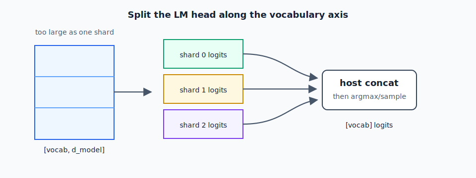

# Chapter 4 — Shard Sizing

A shard is a separately compiled piece of the model. Sharding is not a model
architecture feature; it is a packaging strategy forced by compiler limits,
memory layout, and runtime load costs.

In a desktop GPU runtime, a whole model can often live behind one inference
engine object. On ANE, large transformer models usually have to be split into
layer groups, LM-head slices, and sometimes separate embedding assets. The host
runtime then calls those pieces in order while preserving the same hidden state
flow the original model used.

The central sizing question is: how much model can one CoreML package contain
while still compiling reliably and staying ANE-resident?

## The 250 MB Wall

The ANE compiler (ANEF) imposes a hard limit: compiled model weights ≥ ~1 GB produce
error -14 at compile time. But the practical ceiling for reliable ANE-resident
shards is lower: **~250 MB per `.mlpackage`**.

Validated data points:

| Shard | Size | Layers | Result |
|-------|------|--------|--------|
| Phi-4-mini, 3 layers, INT8 | 223 MB | 3 | ANE-resident ✓ |
| Gemma-4-26B, 1 layer, INT8 | ~180 MB | 1 | ANE-resident ✓ |
| ZAYA1-8B MoE, 1 layer, INT8 | ~120 MB | 1 | ANE-resident ✓ |
| Qwen 1.5B monolithic, INT8 | ~1.5 GB | 28 | Error -14 ✗ |
| Qwen 3B monolithic, INT4 | ~1.7 GB | 36 | Error -14 ✗ |

The 223 MB data point (Phi-4-mini 3-layer shard) is the validated ceiling. Beyond
250 MB, expect ANEF to reject the model.

---

## Layer Counting: How Many Layers Per Shard?

The right number of layers per shard depends on two things:
1. Per-layer weight size (function of `d_model`, `n_heads`, `d_ff`)
2. Whether the shard includes the embedding table and/or LM head

Use formulas only for first-pass planning. The final authority is the compiled
artifact size plus `MLComputePlan`, because CoreML may store weights differently
after quantization, palettization, graph folding, or state packing.

For a dense decoder layer with full multi-head attention, a rough parameter count
is:

```
params_per_layer =
    4 * d_model * d_model              # Q, K, V, O projections
  + 3 * d_model * d_ff                 # SwiGLU gate, up, down projections
  + 2 * d_model                        # RMSNorm weights, usually negligible
```

For grouped-query attention, K and V are smaller than Q and O. Let:

```text
kv_dim = n_kv_heads * d_head
```

Then attention is closer to:

```text
attention_params =
    d_model * d_model                  # Q
  + d_model * kv_dim                   # K
  + d_model * kv_dim                   # V
  + d_model * d_model                  # O
```

For a SwiGLU FFN:

```text
ffn_params = 3 * d_model * d_ff        # gate, up, down
```

At INT8, raw weight size in MB is roughly `params / 1e6`. Treat that as an
estimate, not a promise. A measured `.mlmodelc` size can be lower or higher than
the raw count depending on the conversion path.

Example calculation:

```text
Phi-4-mini planning estimate, using the 32-head / d_head=96 export docs:

d_model = 3072
n_kv_heads = 8
d_head = 96
kv_dim = 768
d_ff = 8192

attention ~= 2 * 3072^2 + 2 * 3072 * 768 = 23.6M params
FFN       ~= 3 * 3072 * 8192              = 75.5M params
total     ~= 99M params before converter-specific packing effects
```

The validated 3-layer Phi-4-mini INT8 shard was 223 MB compiled, so for that
artifact family the measured planning number is about 74 MB per layer. Use the
measured compiled artifact when choosing a shard boundary.

Observed planning numbers from this repository:

| Artifact family | Measured compiled size | Practical packing note |
|-----------------|------------------------|------------------------|
| Phi-4-mini INT8 | 223 MB for 3 layers | 3 layers is near the validated ceiling |
| Gemma-4-26B INT8 | ~180 MB for 1 layer | 1 layer per shard |
| ZAYA MoE INT8, 8-expert book variant | ~120 MB for 1 MoE layer | 1 MoE layer per shard |
| ZAYA Exp 34 RangeDim exporter | ~193-202 MB for 1 16-expert MoE shard | 1 MoE layer per shard |
| Qwen 0.5B INT8 | ~10 MB/layer class | monolithic or large layer groups are plausible |

For models with `d_ff > 16K`, one layer per shard is usually the only viable
starting point.
For MoE models, do not reuse the dense FFN formula directly. A soft-routed MoE
shard that runs all experts must budget every expert's gate/up/down projections,
not only the top-k active experts.

---

## The LM Head Problem

The language model head is a weight matrix of shape `[vocab_size, d_model]`.
For a model with `vocab_size=32000` and `d_model=4096`:

```
LM head: 32000 * 4096 = 131M params → 131 MB at INT8
```

For `vocab_size=151936` (Qwen 2.5 tokenizer):
```
LM head: 151936 * 4096 = 622M params → 622 MB at INT8 → ERROR -14
```

The LM head cannot be a single shard at large vocab sizes.

**Solution: split the LM head into vocab slices**.



```python
# Split into N chunks along vocab dimension
vocab_chunk_size = vocab_size // n_lm_head_shards  # e.g., 4 shards = 32K each

for i in range(n_lm_head_shards):
    start = i * vocab_chunk_size
    end   = start + vocab_chunk_size
    # Build a CoreML shard with lm_head.weight[start:end, :]
    # Input: final hidden state [1, d_model, 1, 1]
    # Output: logit slice [1, vocab_chunk_size, 1, 1]
```

At runtime, run all LM-head shards, concatenate the logit slices, then sample.
The overhead is O(n_lm_head_shards) ANE calls but each call is small.

Phi-4-mini uses 2 LM-head shards. ZAYA1-8B uses 2.

---

## Embedding Table

The embedding table (`[vocab_size, d_model]`) is a lookup, not a matmul. It does
not need to run on ANE. Implement it on the host:

```swift
// Swift: embedding lookup (host-side, not CoreML)
func embed(_ tokenId: Int) -> [Float] {
    let offset = tokenId * dModel
    return Array(embedWeights[offset ..< offset + dModel])
}
```

This is an intentional exception to the ANE-only mandate. Embedding lookup is an
index operation (trivial, O(1)), not a matmul.

---

## Shard Naming Convention

Use a consistent naming scheme so the runtime can discover shards:

```
layers/
  layer_00.mlmodelc/
  layer_01.mlmodelc/
  ...
  layer_N.mlmodelc/
lm_head/
  lm_head_0.mlmodelc/
  lm_head_1.mlmodelc/
embed.bin          ← raw float16 embedding matrix
runtime_meta.json  ← vocab_size, d_model, n_layers, n_lm_head_shards, etc.
```

`runtime_meta.json` example:

```json
{
  "model_name": "phi4-mini",
  "n_layers": 32,
  "n_lm_head_shards": 2,
  "d_model": 3072,
  "n_heads": 32,
  "n_kv_heads": 8,
  "d_head": 96,
  "vocab_size": 100352,
  "max_seq_len": 4096,
  "rangedim_max_t": 4,
  "int8": true
}
```

---

## Shard Sizing Checklist

```
[ ] Per-layer INT8 MB estimated with attention + FFN/MoE formulas
[ ] Compiled `.mlmodelc` size measured before scaling the shard family
[ ] Layers-per-shard chosen to stay under 200 MB (leave 50 MB headroom)
[ ] LM head split if vocab_size * d_model > 200M params
[ ] Embedding table extracted as .bin for host-side lookup
[ ] runtime_meta.json written before building Swift runtime
[ ] Each shard's MLComputePlan checked: 100% ANE conv ops
```
