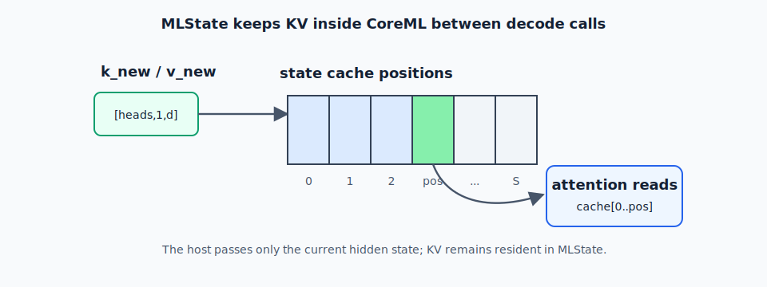

# Chapter 5 — Stateful KV Cache with MLState

A KV cache is the model's memory of the prompt. It stores the key and value rows
that attention needs from previous tokens. Without it, every generated token
would force the model to rebuild attention state for the whole prefix.

The normal decode step is therefore: read the existing cache, compute K/V for the
new token, append those rows at the current position, attend over the prefix, and
produce the next hidden state. The cache is not optional for practical LLM
inference; it is what makes long decode linear in the number of new tokens rather
than repeatedly recomputing old work.

On CoreML, the public way to keep this state inside the model runtime is
`MLState`. This chapter explains how to make that cache explicit enough for
CoreML while keeping the hot path on ANE.

The goal is not just to make the code compile. The goal is to move the cache to
the right owner. If Swift owns the cache, every token becomes a host-memory
traffic problem. If the CoreML layer owns the cache, Swift can stay in its proper
role: pass the current hidden state, the current position, and a few small
bookkeeping tensors, then let the compiled graph update its own memory.

## Why MLState

Without a stateful cache, every decode step must pass the entire KV prefix
(all past keys and values) as CoreML inputs. At seq_len=512 with d_kv=128 and
32 heads, that is:

\[
2 \times 32 \times 512 \times 128 = 4{,}194{,}304
\]

floats per layer, per step.

CoreML's `MLState` stores tensors inside the model's runtime, persisting between
`predict()` calls. The host never touches the KV tensor after write.

That sentence is the whole trick, so it is worth slowing down. In a normal CoreML
call, inputs go in and outputs come back out. Nothing is remembered unless the
host passes it again. With `MLState`, the model also receives a mutable state
object. The graph can read tensors from that object, write updated tensors back
to it, and keep those tensors alive for the next call.

For autoregressive decode, that is exactly what attention needs. Each layer keeps
its own past keys and values. The current token contributes one new key row and
one new value row. The layer writes those rows into the cache slot for the current
position, then reads the prefix to compute attention.

The decode loop reduces to:



The green slot pulses at the current write position: each decode call appends
the new K/V rows, while attention reads the prefix already stored in `MLState`.

```
token → embed → [layer_0(state), layer_1(state), ..., layer_N(state)] → lm_head → sample
```

Each `layer_i(state)` call reads past KV from `state`, appends the new KV, writes
back — all in CoreML. The host passes only the current token's hidden state.

This changes the performance shape of decode. The host still orchestrates the
sequence, but it no longer transports the prefix cache across the API boundary on
every token. The cache moves from "large input tensor" to "persistent model
state".

---

## MLState in coremltools

`MLState` starts in the converter, not in Swift. Swift can only call
`makeState()` if the compiled CoreML model declares stateful tensors. That means
the exported layer must describe which tensors are ordinary inputs and which
tensors are persistent state.

For a single transformer layer, the ordinary input is the current hidden state.
The persistent state is the layer's K cache and V cache. The current position is
usually an ordinary scalar input, because it tells the graph which cache slot to
write.

Think of the layer boundary like this:

```text
ordinary inputs: hidden, pos, masks, RoPE
state inputs:    k_cache, v_cache
ordinary output: out_hidden
state outputs:   updated k_cache, updated v_cache
```

The next few snippets are schematic. They show the ownership pattern you want the
converted graph to have. The exact converter plumbing depends on whether the
source is traced PyTorch, exported PyTorch, or a hand-built MIL program.

### Converting a Stateful Layer

The state declaration gives CoreML a fixed-size backing store for each cache. The
shape is the maximum memory the layer may need during one sequence:

```text
[batch, kv_heads, max_seq_len, head_dim]
```

`max_seq_len` is part of the allocation contract. You cannot grow this cache one
token at a time during generation, so choose it deliberately.

```python
import coremltools as ct

# State specification
k_state_spec = ct.StateType(
    wrapped_type=ct.TensorType(shape=(1, n_kv_heads, max_seq_len, d_head)),
    name="k_cache",
)
v_state_spec = ct.StateType(
    wrapped_type=ct.TensorType(shape=(1, n_kv_heads, max_seq_len, d_head)),
    name="v_cache",
)

model_stateful = ct.convert(
    traced_layer,
    inputs=[ct.TensorType(name="hidden", shape=[1, d_model, 1, 1])],
    states=[k_state_spec, v_state_spec],
    outputs=[ct.TensorType(name="out_hidden")],
    convert_to="mlprogram",
    minimum_deployment_target=ct.target.macOS15,
    compute_units=ct.ComputeUnit.CPU_AND_NE,
)
```

There are three things to notice in this conversion call.

First, `hidden` remains a normal input because it changes every layer call and is
small compared with the full cache. Second, `k_cache` and `v_cache` are listed in
`states`, not in `inputs`, because they must persist across calls. Third, the
deployment target must support public stateful models; in practice this means the
newer CoreML runtime, such as macOS 15-era targets.

This is the point where the model's public interface changes. A stateless layer
says, "give me hidden and I will return hidden." A stateful layer says, "give me
hidden plus a state object, and I will mutate the cache inside that state object
while returning hidden."

### Writing to State in the MIL Graph

Declaring state only allocates storage. The graph still has to write the new K/V
rows into that storage and read them back for attention. Conceptually, the layer
does four operations:

1. Compute the current token's `q_new`, `k_new`, and `v_new` projections.
2. Write `k_new` and `v_new` into cache position `pos`.
3. Read the cache prefix `0...pos`.
4. Run attention against that prefix and produce `out_hidden`.

In a hand-built MIL graph this is expressed with explicit state read/update
operations. In a traced or exported path, the converter has to recognize the same
pattern from the source graph. Either way, the mental model is the same: the
cache update belongs inside the layer graph, not in Swift.

```python
# Schematic graph logic, not a complete converter script.
k_cache = read_state("k_cache")
v_cache = read_state("v_cache")

k_cache = scatter(cache=k_cache, index=pos, value=k_new)
v_cache = scatter(cache=v_cache, index=pos, value=v_new)

update_state("k_cache", k_cache)
update_state("v_cache", v_cache)
```

The standard pattern is to maintain `k_cache` as a pre-allocated tensor of shape
`[1, n_kv_heads, max_seq_len, d_head]`, use a position counter, and scatter
the new key into position `pos`:

```python
# PyTorch forward (will be traced)
def forward(self, hidden, k_cache, v_cache, pos):
    # ... compute Q, K, V from hidden ...
    # Update cache at position pos
    k_cache[:, :, pos:pos+1, :] = k_new  # CoreML sees this as a state write
    v_cache[:, :, pos:pos+1, :] = v_new
    # Attention using full k_cache[:, :, :pos+1, :]
    ...
```

The important part is the write address. The graph must write exactly one token's
K/V rows into exactly one slot. If the position math is wrong, decode can look
almost correct for short prompts and then drift badly because later tokens attend
to corrupted memory. This is why stateful export needs golden-output validation,
not just successful conversion.

Before moving on to Swift, check that the converted layer has the interface you
expected: normal inputs for hidden/position/masks, state entries for K/V, and one
normal hidden-state output. If K/V appear as ordinary inputs and outputs, the
model is not actually stateful from the runtime's point of view.

---

## Swift Runtime for Stateful Decode

Once the layer package declares state, Swift becomes much simpler. It does not
allocate K/V tensors directly. It asks each stateful model to create the state
object that belongs to that model, then passes that same object on every token.

For a sharded transformer stack, the usual pattern is one `MLModel` per layer and
one `MLState` per stateful layer model. A sequence owns the array of states. A
new sequence gets fresh states. A continuing sequence reuses the existing states.

```swift
import CoreML

class ANEDecoder {
    let layers: [MLModel]
    let embeddings: [Float]
    var states: [MLState] = []

    init(layerURLs: [URL], embedURL: URL, config: MLModelConfiguration) throws {
        self.layers = try layerURLs.map { try MLModel(contentsOf: $0, configuration: config) }
        self.embeddings = loadEmbeddings(from: embedURL)
    }

    func beginSequence() throws {
        // Allocate fresh state for a new sequence, once per stateful layer.
        self.states = try layers.map { try $0.makeState() }
    }

    func decode(tokenId: Int, pos: Int) throws -> MLMultiArray {
        // 1. Embed
        var hidden = embedToken(tokenId)  // [1, d_model, 1, 1]

        // 2. Run each layer with its own persistent state
        for (layer, state) in zip(layers, states) {
            let input = try MLDictionaryFeatureProvider(dictionary: [
                "hidden": MLMultiArray(hidden),
                "pos":    MLMultiArray([Int32(pos)]),
            ])
            let out = try layer.prediction(from: input, using: state)
            hidden = out.featureValue(for: "out_hidden")!.multiArrayValue!
        }

        return hidden  // pass to LM head
    }
}
```

The exact runtime in this repository is more careful than this sketch: it loads
models once, preallocates `MLMultiArray` buffers, fills them through direct
pointers, and keeps LM-head reduction separate from layer execution. But the
state lifetime is the same.

Key points:

- Each stateful layer model gets its own `MLState` object for the active sequence.
- `makeState()` is called once at sequence start, not once per token.
- The matching state object is passed as the second argument to `prediction(from:using:)`.
- Ending the sequence means discarding those state objects and creating new ones for the next request.

This division of labor is what keeps the decode loop cache-friendly. Swift owns
small, reusable input buffers. CoreML owns large, persistent K/V tensors. The API
boundary carries the current token's work, not the whole prefix's memory.

---

## The CCA (Cross-Chunk Attention) Pattern

For models with chunked prefill (processing T tokens at once, then switching to
decode T=1), the state must be pre-filled with the prefix before decode starts.

This is the same state mechanism used in a different phase. During prefill, the
runtime walks over prompt chunks and lets each chunk write several K/V positions.
During decode, it writes one position at a time. The state object does not care
which phase wrote the earlier slots; it only needs positions to be consistent.

```swift
// Prefill: run with T=4 (or however large your RangeDim allows)
for chunkStart in stride(from: 0, to: promptLen, by: T) {
    let chunk = promptTokens[chunkStart ..< min(chunkStart+T, promptLen)]
    try runPrefill(tokens: chunk, startPos: chunkStart)  // writes to state
}
// Decode: run T=1 from promptLen onward
while !done {
    let nextToken = try decode(tokenId: lastToken, pos: currentPos)
    currentPos += 1
}
```

The state accumulates KV pairs during prefill, then decode reads them naturally.
No special handling needed — `MLState` persists across both `prediction()` calls.

The practical warning is that chunked prefill makes address math harder. A T=1
decode graph only writes `pos`. A T=4 prefill graph writes `pos`, `pos+1`,
`pos+2`, and `pos+3`. That is where validation usually finds bugs.

---

## Known Bugs and Pitfalls

Stateful decode bugs are unusually sneaky because the first token can look fine.
The cache starts empty, so early output may match the reference even if later
state writes are wrong. Always test more than the first step.

### The Stateful KV Cache RangeDim Bug (2026-04-xx)

Converting a stateful model with `RangeDim` (variable T) and state writes in the
same graph sometimes produces incorrect state write addresses at T > 1.

**Symptom**: Correct output at T=1, silent corruption at T=2+.

**Mitigation**: Validate with `compare_logits.py` at both T=1 and T=4 before shipping.
If T>1 diverges: revert to fixed T=1 for state shards (use RangeDim only for
non-stateful prefill shards, or split prefill/decode into separate shard sets).

### State Size Must Be Pre-Allocated at Max Seq Len

MLState KV cache tensors must be allocated at `max_seq_len`, not dynamically
grown. Set `max_seq_len` conservatively — 4096 is a good default for most models.

For a 32-layer model with `n_kv_heads=8`, `d_head=128`, `max_seq_len=4096`:

\[
\begin{aligned}
	ext{KV cache memory}
&= 32 \times 2 \times 8 \times 4096 \times 128 \times 2\ \text{bytes} \\
&\approx 4\ \text{GB}
\end{aligned}
\]

On M4 Max (48 GB unified memory) this is fine. On 16 GB machines, reduce
`max_seq_len` or use fewer layers per state bundle.

This memory is not a leak; it is the price of keeping the cache resident and
ready. The mistake is sizing it accidentally. Choose `max_seq_len` as part of the
product target, then verify that model weights, KV state, intermediate buffers,
and the rest of the process fit in unified memory at the same time.

---

## Checklist

```
[ ] StateType spec declares correct shape [1, n_kv_heads, max_seq_len, d_head]
[ ] makeState() called once per sequence (not per token)
[ ] state passed to every prediction() call
[ ] T=1 and T>1 outputs validated against PyTorch golden
[ ] max_seq_len fits in unified memory budget
```
