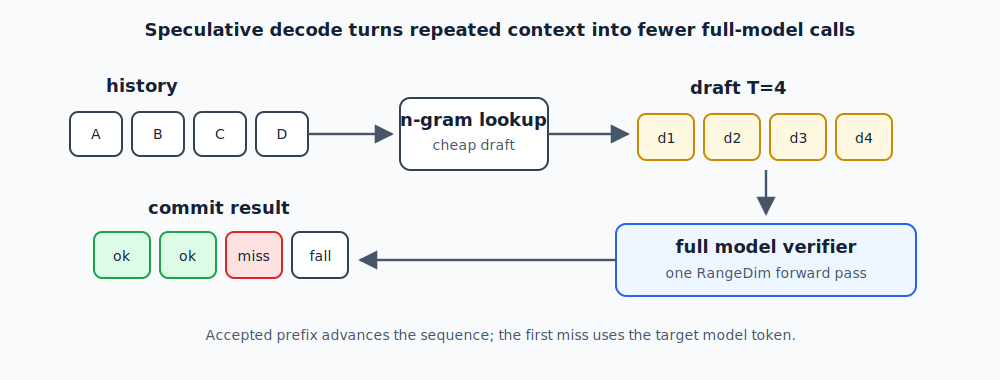

# Chapter 6 — RangeDim and Speculative Decode

## The Prefill/Decode Asymmetry

LLM inference has two phases with opposite bottlenecks:

- **Prefill**: process N tokens in parallel. Bottleneck: compute (matrix-vector → matrix-matrix).
- **Decode**: generate one token at a time. Bottleneck: memory bandwidth (load all weights for a single vector).

A naive port to ANE runs both at T=1 (one token per CoreML call). This works but
leaves prefill speed on the table — the ANE can process multiple tokens in one
kernel launch, but you need the model to accept variable-length inputs.

---

## RangeDim: Variable Sequence Length in CoreML

CoreML `RangeDim` declares that a particular dimension can vary between a min and
max value at runtime, without recompiling:

```python
ct.TensorType(
    name="hidden",
    shape=[1, d_model, ct.RangeDim(lower_bound=1, upper_bound=4), 1]
)
```

This tells CoreML: "the T dimension (height) can be 1, 2, 3, or 4 tokens."

At runtime, you pass actual T-length tensors and CoreML handles the dispatch.
The same `.mlmodelc` is used for T=1 (decode) and T=2,3,4 (speculative / prefill).

**Upper bound**: set to 4 for decode + n-gram speculative. Set higher (e.g., 128)
for aggressive prefill, but test ANE residency — very large T can trigger fallback.

---

## n-Gram Speculative Decode

The idea: instead of generating tokens one at a time, draft `n` candidate tokens
using a cheap heuristic (n-gram lookup), verify all `n` at once with the full model
in a single T=n forward pass, and accept as many as are correct.



The accepted draft prefix glows green; the first mismatch becomes the fallback
token from the full model verifier.

Expected tokens/call with n-gram matching on natural language:
- T=1: 1.0 tokens/call (baseline)
- T=4 with good n-gram hit rate: 2.5–3.5 effective tokens/call

The acceptance logic:

```swift
func speculativeDecode(prompt: [Int], maxNew: Int) -> [Int] {
    var tokens = prompt
    var pos = prompt.count

    while tokens.count < prompt.count + maxNew {
        // Draft: look up next n tokens from n-gram table
        let drafts = ngramLookup(tokens.suffix(3), n: 4)  // [d1, d2, d3, d4]
        let T = drafts.count

        // Verify: one forward pass with T tokens
        let hidden = embedTokens(drafts, startPos: pos)  // [1, d_model, T, 1]
        let logits = forwardPass(hidden, startPos: pos)  // [1, vocab, T, 1]

        // Accept prefix of drafts that match argmax
        var accepted = 0
        for i in 0..<T {
            let predicted = argmax(logits[i])
            if i == 0 || predicted == drafts[i-1] {
                tokens.append(predicted)
                accepted += 1
            } else {
                break
            }
        }

        pos += accepted
        if accepted == 0 { break }  // no drafts accepted, fall back to greedy
    }
    return Array(tokens.dropFirst(prompt.count))
}
```

**N-gram table construction**: at inference time, maintain a `[Int: [Int]: Int]`
map from context → next token, updated with every generated token. No external data.

---

## RangeDim Conversion

```python
# Convert with RangeDim T=1..4
example_input = torch.zeros(1, d_model, 4, 1)
traced = torch.jit.trace(layer.eval(), example_input)

model = ct.convert(
    traced,
    inputs=[ct.TensorType(
        name="hidden",
        shape=[1, d_model, ct.RangeDim(lower_bound=1, upper_bound=4), 1]
    )],
    outputs=[ct.TensorType(name="out_hidden")],
    convert_to="mlprogram",
    minimum_deployment_target=ct.target.macOS15,
    compute_units=ct.ComputeUnit.CPU_AND_NE,
)
```

**Trace at T=4** (the max), not T=1. Tracing at T=1 can cause CoreML to bake in
the wrong slice shapes for the cache writes.

---

## Stateful + RangeDim: Known Complication {#stateful--rangedim-known-complication}

Combining stateful KV cache with RangeDim is the trickiest configuration.

The state write (`k_cache[:, :, pos:pos+T, :]`) uses a dynamic slice that depends
on `T`. CoreML's MIL must see this as a valid scatter operation for the state
backend to accept it.

**Validation recipe**:
1. Run T=1 prefill. Capture output logits.
2. Run T=1 prefill again from scratch using T=1 in a loop.
3. Compare outputs at every position — must be identical.
4. If divergence appears at T>1 but not T=1, the state write has a bug.

In practice: ZAYA1-8B uses RangeDim T=1..4 with stateful attention (CCA validated).
Phi-4-mini uses RangeDim T=1..4, stateful, validated at 17 tok/s decode.

---

## Benchmarked Speeds (M4 Max, 48 GB)

| Model | Config | tok/s |
|-------|--------|-------|
| Phi-4-mini 3.8B | INT8, RangeDim T=1..4, stateful | ~17 |
| Hy-MT 1.5B translation | INT8, RangeDim, stateful | ~34 |
| ZAYA1-8B MoE | INT8, RangeDim T=1..4, stateful | ~9 |
| Privacy Filter ~1.5B MoE | INT8, T=1 | ~24.6 sent/s |

---

## Checklist

```
[ ] Traced at T=max (not T=1)
[ ] RangeDim(lower_bound=1, upper_bound=N) matches Swift runtime expectations
[ ] MLComputePlan checked at both T=1 and T=max — 100% ANE both cases
[ ] Stateful writes validated: T=1 and T>1 outputs agree vs PyTorch
[ ] n-gram table populated from prompt context before decode starts
```
