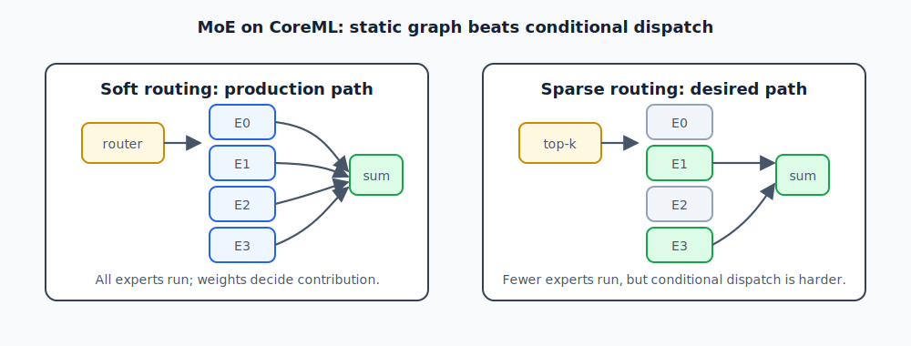

# Chapter 7 — Mixture of Experts on ANE

A dense transformer layer runs the same feed-forward network for every token. A
Mixture of Experts layer replaces that single FFN with multiple expert FFNs and a
router that decides which experts should handle each token.

The attraction is scale: a model can have many expert parameters without running
all of them for every token. The difficulty is dispatch: sparse MoE wants dynamic
control flow, while CoreML wants a static graph that can be compiled ahead of
time. This chapter is about turning a conditional model design into something
the ANE compiler can place and the runtime can call efficiently.

## Why MoE on ANE Is Hard

A Mixture of Experts layer replaces the standard FFN block with N expert FFNs
and a router that selects which K experts to run per token. For a model like
the 8-expert ZAYA1-8B variant described below (28 MoE layers, 8 experts/layer,
top-2 routing), you need to:

1. Run the router (a small linear projection → softmax)
2. Select the top-2 expert indices per token
3. Run only those 2 expert FFNs (not all 8)
4. Weighted-sum their outputs

Steps 1 and 2 are trivial. Steps 3 and 4 are the hard part: how do you
conditionally dispatch to a subset of 8 expert FFNs, on ANE, per token?



---

## Approach 1: Soft Routing (Weighted Sum of All Experts)

Instead of conditionally dispatching, run ALL experts and compute a weighted sum
where non-selected experts have weight 0:

```python
# All 8 expert outputs
expert_outs = [experts[i](x) for i in range(n_experts)]  # 8 × [1, d_model, T, 1]

# Router weights for each expert (from softmax)
router_weights = router(x)  # [1, n_experts, T, 1] or [n_experts] for T=1

# Weighted sum
out = sum(w_i * e_i for w_i, e_i in zip(router_weights, expert_outs))
```

**Pros**: Fully vectorized. All experts run every step. Simple CoreML graph.
**Cons**: 4× compute vs top-2 sparse routing (8 experts run vs 2 used).

Some variants explicitly mask the router to top-k before the weighted sum. Other
variants use the full softmax distribution and rely on the inactive experts being
near-zero. The ANE tradeoff is the same in both cases: the graph runs every
expert so the compiled program has no data-dependent branch.

This is the approach used in ZAYA1-8B's production CoreML shards. At 9 tok/s on
M4 Max with 8 experts, the overhead is acceptable and the graph stays fully ANE.

The key: soft routing keeps the compute graph **static** (no dynamic branches),
which is what CoreML requires. CoreML has no `if` — only tensor operations.

---

## Approach 2: Per-Expert Shards with MLMultiFunction

CoreML 9 introduced `MLMultiFunctionDescriptor`, the public API for calling a
specific procedure in a multi-function model:

```swift
let descriptor = MLMultiFunctionDescriptor(functionName: "expert_3")
let config = MLModelConfiguration()
config.functionName = "expert_3"
let model = try MLModel(contentsOf: expertPackageURL, configuration: config)
```

The private-API equivalent is `_ANEChainingRequest._procedureIndex`. Both let
you address one procedure out of N in a single `.mlpackage`.

**Build a multi-function expert package**:

```python
# Build one mlpackage with N expert functions
# Each function is one expert's FFN
# coremltools 9 supports MLMultiFunction via custom MIL programs
```

This approach enables sparse routing (only K of N experts run per step) at the cost
of implementation complexity. The ANE chain primitive handles dispatch without
host round-trips.

**Status**: Validated at the private-API layer (ANE_CHAIN_SCHEMA.md). Full
public-API path through `MLMultiFunctionDescriptor` requires coremltools 9 MIL
custom programs. Not yet in production in this repo.

---

## ZAYA1-8B Architecture

ZAYA is a 1.58-bit-average-binarized model trained from LLaMA-2-7B using
"1-bit" techniques. Our CoreML port is the first ANE-native MoE of this class.

Variant note: this chapter describes the 8-expert, 28-layer ZAYA book/runtime
variant documented in `models/zaya/README.md`. The checked-in
`converters/zaya_full_convert.py` file is an Exp 34 RangeDim exporter for a
different ZAYA artifact family: `H=2048`, 16 experts plus one null router slot,
and MoE layers `1,3,...,79` (40 MoE shards). Do not use that converter as the
source of truth for the dimensions in this section without also adopting that
Exp 34 manifest family.

Key dimensions:
- 28 MoE layers
- 8 experts per layer, top-2 routing
- `d_model=4096`, `n_heads=32`, `n_kv_heads=8`, `d_head=128`
- Per-expert FFN: `d_model × d_ff/n_experts × d_model` (soft-routed)
- Embedding: `vocab_size × d_model` = 32000 × 4096

Shard structure (58 compiled model shards):
```
zaya_ane/
├── attn/          # 28 attention shards (one per layer)
├── moe/           # 28 MoE FFN shards (one per layer, all 8 experts inside)
├── lm_head/       # 2 vocabulary-half shards
├── zaya_embed.bin # float16 embedding matrix
└── zaya_runtime_meta.json
```

Each attention shard: `[1, d_model, T, 1]` → attention + residual → `[1, d_model, T, 1]`  
Each MoE shard: `[1, d_model, T, 1]` → router + 8 experts soft-sum + residual → `[1, d_model, T, 1]`

---

## Packing All Experts Into One Shard

For ZAYA, all 8 expert FFNs are packed into a single `.mlpackage` per layer.
The packed MoE FFN:

```python
class MoEFFN(nn.Module):
    def __init__(self, d_model, d_ff, n_experts):
        super().__init__()
        # All experts as Conv2d, stacked
        self.gate_projs = nn.ModuleList([
            nn.Conv2d(d_model, d_ff, 1, bias=False) for _ in range(n_experts)
        ])
        self.up_projs   = nn.ModuleList([...])
        self.down_projs = nn.ModuleList([...])
        self.router     = nn.Conv2d(d_model, n_experts, 1, bias=False)

    def forward(self, x):
        # Router: [1, n_experts, T, 1]
        router_logits = self.router(x)
        router_weights = torch.softmax(router_logits, dim=1)

        # All 8 experts (soft routing)
        out = torch.zeros_like(x)
        for i, (gate, up, down) in enumerate(zip(self.gate_projs, self.up_projs, self.down_projs)):
            expert_out = down(torch.nn.functional.silu(gate(x)) * up(x))
            w = router_weights[:, i:i+1, :, :]  # [1, 1, T, 1]
            out = out + w * expert_out

        return out
```

The loop over 8 experts is unrolled by TorchScript tracing — CoreML sees 8 ×
(gate + up + down + silu + mul + add) = 24 conv ops per MoE shard. All land on ANE.

---

## Privacy Filter: MoE NER

The Privacy Filter is a different MoE application: Named Entity Recognition for
PII detection. Model: ~1.5B parameters, 8 MoE experts, specialized for
identifying names, phone numbers, emails, addresses.

Key differences from ZAYA:
- Output is token labels (BIO tags), not next-token logits
- Soft routing is a hard requirement (all entities must be detected, no sampling)
- End-to-end Swift wrapper handles BIO → span extraction → redaction

Performance: ~24.6 sentences/sec on M4 Max.

See `models/privacy-filter/` for build scripts.

---

## The ANE Chain Primitive (Advanced)

For future work on sparse routing without running all experts, the ANE private
runtime's chain primitive is the right tool. From `ANE_CHAIN_SCHEMA.md`:

- `_ANEChainingRequest._procedureIndex` selects one of N procedures per call
- `_ANEOutputSetEnqueue` enables a single chain submission to fan out across N procedures
- `_memoryPoolId` keeps activations in-device across stages — no host copy
- `_isOpenLoop` allows async/streaming dispatch (fire-and-forget expert prefetch)

This maps onto sparse MoE dispatch: load one `.mlmodelc` per MoE layer with N
expert procedures. Per token, build a `_ANEChainingRequest` with the top-K
procedure indices. The ANE runs those K experts and returns the sum.

Status: validated at the ObjC runtime reflection level. Implementation in
`local-artifacts/ane_chain_probe.m`. Full production use requires bypassing
CoreML's public API — contact Apple if you want this officially.

---

## Checklist

```
[ ] Soft routing graph has no conditional branches (pure tensor math)
[ ] All expert ops land on ANE (MLComputePlan: 100%)
[ ] Cosine vs PyTorch golden ≥ 0.97 (routing weights may amplify small errors)
[ ] MoE shard size: 8 experts × per-expert MB ≤ 200 MB total
[ ] If packing > 8 experts: verify ANEF doesn't hit error -14
[ ] For Privacy Filter: BIO output validated on PII examples
```
