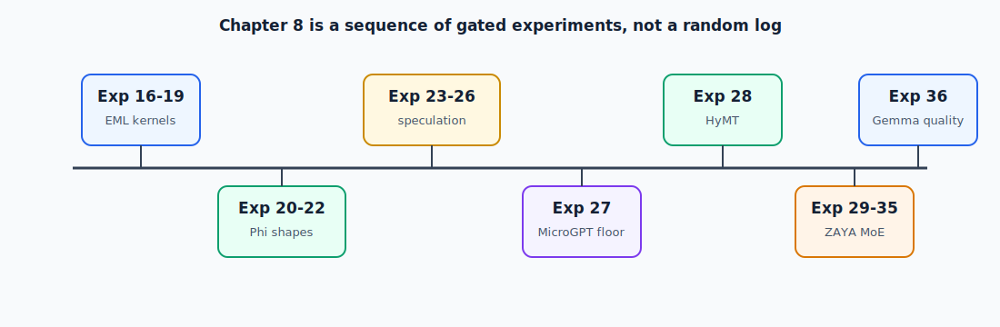

# Chapter 8 — Experiment Index

**Date**: 2026-04-14  
**Purpose**: Mine 9 classic CS/math books for new AutoEML kernel optimization ideas.  
**Context**: After 15 experiments (7 kept, 8 reverted), the kernel is at 3,917 μs / 803,712 transcendentals.  
We need fundamentally new strategies, not incremental tuning.

---

## Books Surveyed

| # | Book | Author(s) | Key Chapters Studied |
|---|------|-----------|---------------------|
| a | *Concrete Mathematics* | Graham, Knuth, Patashnik | Ch. 2 (Summation), Ch. 7 (Generating Functions), Ch. 9 (Asymptotics) |
| b | *The Art of Computer Programming* | Knuth | Vol. 2 Ch. 4 (Arithmetic), Vol. 4A–4B (Combinatorial), Fascicles 5–7 (Backtracking, SAT, Constraint Satisfaction) |
| c | *Elements of Programming* | Stepanov, McJones | Foundations, Associative Operations, Semigroups, Orbits |
| d | *A Programming Language* | Iverson | Array operators, Inner/Outer product, Reduction operators |
| e | *Thinking Forth* | Brodie | Factoring, stack discipline, composition-as-optimization |
| f | *Compilers: Principles, Techniques, and Tools* (Dragon Book) | Aho, Lam, Sethi, Ullman | Code optimization, peephole optimization, data flow analysis, register allocation |
| g | *Elements of Automata Theory* | Sakarovitch | Weighted automata, transducers, semirings |
| h | *Types and Programming Languages* (TAPL) | Pierce | Type inference, System F, subtyping, polymorphism |
| i | *Constraint Processing* | Dechter | Arc consistency (AC-3), constraint propagation, backtracking, CSP formulation |

---

This chapter is split into one page per numbered experiment so the log is easier
to search, link, and scan.

## Experiments

| # | Experiment | Theme |
|---|------------|-------|
| [16](experiments/16-log-sum-exp-peephole-rewrite.html) | Log-Sum-Exp Peephole Rewrite | AutoEML kernel idea |
| [17](experiments/17-fused-apl-style-inner-product.html) | Fused APL-Style Inner Product | AutoEML kernel idea |
| [18](experiments/18-constraint-propagation-for-realness.html) | Constraint Propagation for Realness | AutoEML kernel idea |
| [19](experiments/19-balanced-tree-reduction-semigroup-accumulator.html) | Balanced Tree Reduction (Semigroup Accumulator) | AutoEML kernel idea |
| [20](experiments/20-weighted-automaton-layer-partition-search.html) | Weighted-Automaton Layer Partition Search | Phi / speculative decode |
| [21](experiments/21-apl-style-token-stream-batching.html) | APL-Style Token/Stream Batching | Phi / speculative decode |
| [22](experiments/22-hierarchical-lm-head-reduction.html) | Hierarchical LM-Head Reduction | Phi / speculative decode |
| [23](experiments/23-prompt-lookup-n-gram-speculation.html) | Prompt-Lookup / N-Gram Speculation | Phi / speculative decode |
| [24](experiments/24-structured-cot-as-a-grammar-constrained-sampler.html) | Structured CoT as a Grammar-Constrained Sampler | Phi / speculative decode |
| [25](experiments/25-prompt-lookup-force-mode-as-a-head-skip-ceiling.html) | Prompt-Lookup Force Mode as a Head-Skip Ceiling | Phi / speculative decode |
| [26](experiments/26-multi-token-verifier-feasibility.html) | Multi-Token Verifier Feasibility | Phi / speculative decode |
| [27](experiments/27-microgpt-on-ane-minimum-size-constraint-discovery.html) | MicroGPT on ANE — Minimum Size Constraint Discovery | ANE size floor |
| [28](experiments/28-hymt-1-8b-rangedim-t-1-4-n-gram-speculative-decode.html) | HyMT 1.8B RangeDim T=1..4 + N-Gram Speculative Decode | HyMT RangeDim |
| [29](experiments/29-zaya1-8b-moe-feasibility-probe-on-ane.html) | ZAYA1-8B MoE Feasibility Probe on ANE | ZAYA MoE |
| [30](experiments/30-zaya1-8b-stateful-attn-shards-kv-cache-on-ane.html) | ZAYA1-8B Stateful Attn Shards + KV Cache on ANE | ZAYA MoE |
| [31](experiments/31-zaya1-8b-cca-conv-qk-gates-wired-into-40-stateful-attn-shards-2025-07-14.html) | ZAYA1-8B CCA (conv_qk) gates wired into 40 stateful attn shards (2025-07-14) | ZAYA MoE |
| [32](experiments/32-zaya1-8b-speculative-decode-t-4-verifier-n-gram-implemented-bottlenecked.html) | ZAYA1-8B Speculative Decode (T=4 Verifier + n-gram) [IMPLEMENTED; BOTTLENECKED] | ZAYA MoE |
| [33](experiments/33-phi-4-mini-arc-challenge-eval-5-shot-raw-completion-complete.html) | Phi-4-mini ARC-Challenge Eval (5-shot, raw completion) [COMPLETE] | Phi evaluation |
| [34](experiments/34-zaya1-8b-moe-rangedim-rebuild-t-1-4-speculative-moe-complete.html) | ZAYA1-8B MoE RangeDim Rebuild (T=1..4 speculative MoE) [COMPLETE] | ZAYA MoE |
| [35](experiments/35-zaya1-8b-moe-int4pal-per-grouped-channel-palettization-group-size-32-complete.html) | ZAYA1-8B MoE INT4pal (per-grouped-channel palettization, group_size=32) [COMPLETE] | ZAYA MoE |
| [36](experiments/36-gemma-4-26b-a4b-int8-per-channel-rebuild-t4-3-quality-fix.html) | Gemma 4-26B-A4B INT8 Per-Channel Rebuild — T4.3 Quality Fix | Gemma quality gate |

---

### Additional Ideas (Lower Priority, for Future Work)

#### Weighted Automaton Scheduling
**Source**: Sakarovitch, *Elements of Automata Theory* — weighted automata over semirings

Model EML evaluation as a weighted transducer over the (min,+) semiring:
- States = sets of live register values
- Transitions = EML operations
- Weights = operation latency (exp/ln ≈ 10 cycles, add ≈ 1 cycle)

Minimum-weight path = optimal instruction schedule. More principled than manual 
reordering experiments.

#### Forth-Style Factoring
**Source**: Brodie, *Thinking Forth*

Factor the monolithic kernel into small composable "words": `eml_dot_word`, 
`eml_acc_word`, `eml_sign_word`. The composition boundaries become optimization 
boundaries where the Rust compiler can make independent inlining/vectorization 
decisions.

#### TAPL-Inspired Phantom Types
**Source**: Pierce, *TAPL* — type inference, System F

Encode EML value domains (`EmlReal(f64)`, `EmlComplex(Complex64)`, 
`EmlPositiveReal(f64)`) as Rust phantom types. The type system then enforces 
and optimizes domain transitions at compile time — the type-theoretic version 
of Experiment 18, resolved statically.

---

## Experiment Execution Order

| Order | Exp | Rationale |
|-------|-----|-----------|
| 1 | 17 (Fused APL dot) | Highest potential: K→1 ln reduction. Subsumes Exp 16. |
| 2 | 16 (LSE rewrite) | If Exp 17 isn't viable as full fusion, LSE is the fallback. |
| 3 | 18 (Constraint propagation) | Generalize real-bypass. Independent of 16/17. |
| 4 | 19 (Tree reduction) | ILP improvement. Can stack on top of 16/17. |

---

## References

These are the sources behind the first experiment set:

- Aho, Lam, Sethi, and Ullman, *Compilers: Principles, Techniques, and Tools*,
  section 8.7, for the peephole-optimization framing of the log-sum-exp rewrite.
- Iverson, K. E., *A Programming Language* (1962), for the inner product operator
  `+.×` as a first-class fused array operation.
- Dechter, R., *Constraint Processing* (2003), chapter 3, and Mackworth, A. K.,
  "Consistency in Networks of Relations" (1977), for arc consistency and AC-3.
- Stepanov, A. and McJones, P., *Elements of Programming* (2009), chapters 4 and
  5, and Blelloch, G., "Prefix Sums and Their Applications" (1990), for
  associative reductions and balanced tree evaluation.
- Odrzywołek, A., "All elementary functions from a single binary operator"
  (2026), arXiv:2603.21852, for the EML operator itself.

---
