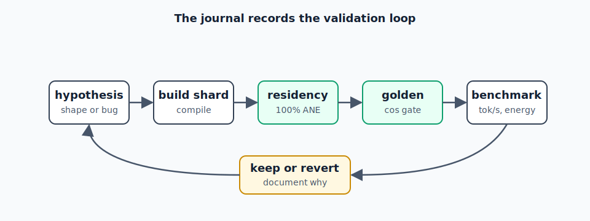

# Chapter 9 - Decision Journal

Chronological index of decision entries.

## 2026-04-26

| Entry | Decision |
|---|---|
| [001](journal/001-fp16-gemma-ane-rebuild-retry-requested.html) | FP16 Gemma ANE Rebuild Retry Requested |

## 2026-04-27

| Entry | Decision |
|---|---|
| [002](journal/002-phi-4-mini-instruct-ane-support-scaffolding-intent.html) | Phi-4-mini-instruct ANE Support Scaffolding Intent |
| [003](journal/003-phi-4-mini-instruct-layer-0-gate-residency-passed.html) | Phi-4-mini-instruct Layer-0 Gate Residency Passed |
| [004](journal/004-phi-4-mini-layer-0-numerical-smoke-passed.html) | Phi-4-mini Layer-0 Numerical Smoke Passed |
| [005](journal/005-phi-4-mini-layer-1-guarded-smoke-intent.html) | Phi-4-mini Layer-1 Guarded Smoke Intent |
| [006](journal/006-phi-4-mini-layer-1-guarded-smoke-passed.html) | Phi-4-mini Layer-1 Guarded Smoke Passed |
| [007](journal/007-phi-4-mini-layers-2-3-bounded-smoke-intent.html) | Phi-4-mini Layers 2–3 Bounded Smoke Intent |
| [008](journal/008-phi-4-mini-layers-2-3-bounded-smoke-passed.html) | Phi-4-mini Layers 2–3 Bounded Smoke Passed |
| [009](journal/009-phi-4-mini-bounded-run-range-orchestration-intent.html) | Phi-4-mini Bounded Run-Range Orchestration Intent |
| [010](journal/010-phi-4-mini-bounded-run-range-orchestration-landed.html) | Phi-4-mini Bounded Run-Range Orchestration Landed |
| [011](journal/011-phi-4-mini-layers-4-7-bounded-run-range-intent.html) | Phi-4-mini Layers 4–7 Bounded Run-Range Intent |
| [012](journal/012-phi-4-mini-layers-4-7-bounded-run-range-passed.html) | Phi-4-mini Layers 4–7 Bounded Run-Range Passed |
| [013](journal/013-phi-4-mini-four-layer-batch-runner-intent.html) | Phi-4-mini Four-Layer Batch Runner Intent |
| [014](journal/014-phi-4-mini-layers-8-11-run-batches-intent.html) | Phi-4-mini Layers 8–11 Run-Batches Intent |
| [015](journal/015-phi-4-mini-run-batches-landed-and-layers-8-11-passed.html) | Phi-4-mini Run-Batches Landed and Layers 8–11 Passed |
| [016](journal/016-phi-4-mini-layers-12-15-run-batches-intent.html) | Phi-4-mini Layers 12–15 Run-Batches Intent |
| [017](journal/017-phi-4-mini-layers-12-15-run-batches-passed.html) | Phi-4-mini Layers 12–15 Run-Batches Passed |
| [018](journal/018-phi-4-mini-remaining-layers-16-31-run-batches-intent.html) | Phi-4-mini Remaining Layers 16–31 Run-Batches Intent |
| [019](journal/019-phi-4-mini-all-32-layer-shards-completed.html) | Phi-4-mini All 32 Layer Shards Completed |
| [020](journal/020-phi-4-mini-lm-head-shard-builder-intent.html) | Phi-4-mini LM Head Shard Builder Intent |
| [021](journal/021-phi-4-mini-lm-head-shards-passed.html) | Phi-4-mini LM Head Shards Passed |
| [022](journal/022-phi-4-mini-runtime-scaffolding-smoke-passed.html) | Phi-4-mini Runtime Scaffolding Smoke Passed |
| [023](journal/023-phi-4-mini-tok-s-timing-smoke-intent.html) | Phi-4-mini Tok/s Timing Smoke Intent |
| [024](journal/024-phi-4-mini-provisional-tok-s-timing-smoke.html) | Phi-4-mini Provisional Tok/s Timing Smoke |
| [025](journal/025-phi-4-mini-lean-ane-runtime-optimization-intent.html) | Phi-4-mini Lean ANE Runtime Optimization Intent |
| [026](journal/026-phi-4-mini-lean-ane-runtime-optimization-outcome.html) | Phi-4-mini Lean ANE Runtime Optimization Outcome |
| [027](journal/027-phi-4-mini-decode-profile-intent.html) | Phi-4-mini Decode Profile Intent |
| [028](journal/028-phi-4-mini-two-layer-full-shard-probe-intent.html) | Phi-4-mini Two-Layer Full-Shard Probe Intent |
| [029](journal/029-phi-4-mini-decode-profile-and-two-layer-probe-outcome.html) | Phi-4-mini Decode Profile and Two-Layer Probe Outcome |
| [030](journal/030-phi-4-mini-three-layer-full-shard-probe-intent.html) | Phi-4-mini Three-Layer Full-Shard Probe Intent |
| [031](journal/031-phi-4-mini-three-layer-full-shard-probe-passed.html) | Phi-4-mini Three-Layer Full-Shard Probe Passed |
| [032](journal/032-phi-4-mini-full-3-layer-shard-strategy-validation-intent.html) | Phi-4-mini Full 3-Layer Shard Strategy Validation Intent |
| [033](journal/033-llm-int8-ane-conv2d-adaptation-review-intent.html) | LLM.int8() ANE Conv2D Adaptation Review Intent |
| [034](journal/034-phi-4-mini-full-3-layer-shard-strategy-validated.html) | Phi-4-mini Full 3-Layer Shard Strategy Validated |
| [035](journal/035-phi-4-mini-fused-runtime-migration-intent.html) | Phi-4-mini Fused Runtime Migration Intent |
| [036](journal/036-phi-4-mini-fused-runtime-migration-outcome.html) | Phi-4-mini Fused Runtime Migration Outcome |
| [037](journal/037-phi-4-mini-four-layer-fused-shard-intent.html) | Phi-4-mini Four-Layer Fused Shard Intent |
| [038](journal/038-phi-4-mini-four-layer-fused-shard-residency-passed.html) | Phi-4-mini Four-Layer Fused Shard Residency Passed |
| [039](journal/039-phi-4-mini-four-layer-fused-shard-golden-passed.html) | Phi-4-mini Four-Layer Fused Shard Golden Passed |
| [040](journal/040-phi-4-mini-full-4-layer-fused-strategy-intent.html) | Phi-4-mini Full 4-Layer Fused Strategy Intent |
| [041](journal/041-phi-4-mini-full-4-layer-fused-strategy-completed.html) | Phi-4-mini Full 4-Layer Fused Strategy Completed |
| [042](journal/042-phi-4-mini-isolated-warm-cache-outcome.html) | Phi-4-mini Isolated Warm Cache Outcome |

## 2026-04-28

| Entry | Decision |
|---|---|
| [043](journal/043-ane-internals-synthesis-before-phi-daemon.html) | ANE Internals Synthesis Before Phi Daemon |
| [044](journal/044-phi-4-mini-resident-serve-mode-landed.html) | Phi-4-mini Resident Serve Mode Landed |
| [045](journal/045-phi-4-mini-five-layer-fused-strategy-intent.html) | Phi-4-mini Five-Layer Fused Strategy Intent |
| [046](journal/046-phi-4-mini-six-layer-fused-strategy-intent.html) | Phi-4-mini Six-Layer Fused Strategy Intent |
| [047](journal/047-phi-4-mini-five-and-six-layer-fusion-outcome.html) | Phi-4-mini Five- and Six-Layer Fusion Outcome |
| [048](journal/048-phi-4-mini-lm-head-optimization-outcome.html) | Phi-4-mini LM-Head Optimization Outcome |
| [049](journal/049-phi-4-mini-eight-layer-fused-shard-intent.html) | Phi-4-mini Eight-Layer Fused Shard Intent |
| [050](journal/050-phi-4-mini-eight-layer-asymmetric-fusion-outcome.html) | Phi-4-mini Eight-Layer Asymmetric Fusion Outcome |
| [051](journal/051-phi-4-mini-twelve-layer-front-shard-intent.html) | Phi-4-mini Twelve-Layer Front Shard Intent |
| [052](journal/052-phi-4-mini-sixteen-layer-front-shard-intent.html) | Phi-4-mini Sixteen-Layer Front Shard Intent |
| [053](journal/053-phi-4-mini-twenty-four-layer-front-shard-intent.html) | Phi-4-mini Twenty-Four-Layer Front Shard Intent |
| [054](journal/054-phi-4-mini-twenty-layer-front-shard-intent.html) | Phi-4-mini Twenty-Layer Front Shard Intent |
| [055](journal/055-phi-4-mini-12-16-20-24-layer-fusion-sweep-outcome.html) | Phi-4-mini 12/16/20/24-Layer Fusion Sweep Outcome |
| [056](journal/056-private-ane-chaining-investigation-intent.html) | Private ANE Chaining Investigation Intent |
| [057](journal/057-private-ane-api-bridge-outcome.html) | Private ANE API Bridge Outcome |
| [058](journal/058-coreml-e5-bridge-operation-handles-recovered.html) | CoreML E5 Bridge Operation Handles Recovered |
| [059](journal/059-coreml-e5-two-operation-stream-binder-outcome.html) | CoreML E5 Two-Operation Stream Binder Outcome |
| [060](journal/060-tiny-e5-execution-controls-outcome.html) | Tiny E5 Execution Controls Outcome |
| [061](journal/061-e5-binder-timing-controls-outcome.html) | E5 Binder Timing Controls Outcome |
| [062](journal/062-e5-setupoperationforinputfeatures-replaces-pool.html) | E5 setupOperationForInputFeatures Replaces Pool |
| [063](journal/063-raw-e5rt-two-model-chain-breakthrough.html) | Raw E5RT Two-Model Chain Breakthrough |
| [064](journal/064-phi-stateful-raw-e5rt-chain-smoke.html) | Phi Stateful Raw E5RT Chain Smoke |
| [065](journal/065-phi-public-two-call-reference-and-e5-event-probe.html) | Phi Public Two-Call Reference and E5 Event Probe |
| [066](journal/066-phi-e5-objc-sync-point-experiment.html) | Phi E5 ObjC Sync-Point Experiment |
| [067](journal/067-phi-e5-direct-objc-event-bind-outcome.html) | Phi E5 Direct ObjC Event Bind Outcome |
| [068](journal/068-phi-e5-second-operation-boundary-narrowed.html) | Phi E5 Second-Operation Boundary Narrowed |
| [069](journal/069-phi-e5-raw-memory-bridge-breakthrough.html) | Phi E5 Raw Memory Bridge Breakthrough |
| [070](journal/070-phi-full-fused-topology-runs-in-one-e5-stream.html) | Phi Full Fused Topology Runs in One E5 Stream |
| [071](journal/071-phi-private-e5-one-stream-timing-reality-check.html) | Phi Private E5 One-Stream Timing Reality Check |
| [073](journal/073-phi-lm-head-shard-count-sweep-on-best-topology.html) | Phi LM-Head Shard Count Sweep on Best Topology |
| [074](journal/074-phi-long-decode-topology-baseline-moves-to-20-4-6-2.html) | Phi Long-Decode Topology Baseline Moves to 20+4+6+2 |
| [075](journal/075-phi-private-e5-timing-on-20-4-6-2.html) | Phi Private E5 Timing on 20+4+6+2 |
| [076](journal/076-phi-weighted-topology-search-starts.html) | Phi Weighted Topology Search Starts |
| [077](journal/077-phi-20-5-5-2-tail-probe.html) | Phi 20+5+5+2 Tail Probe |
| [078](journal/078-phi-4-mini-next-public-optimization-direction-intent.html) | Phi-4-mini Next Public Optimization Direction Intent |
| [079](journal/079-phi-lm-head-top-k-shard-residency-failed.html) | Phi LM-Head Top-K Shard Residency Failed |
| [080](journal/080-phi-batch-4-lm-head-shape-probe-passed.html) | Phi Batch-4 LM-Head Shape Probe Passed |
| [081](journal/081-phi-batch-4-lm-head-full-set-gated.html) | Phi Batch-4 LM-Head Full Set Gated |

## 2026-04-29

| Entry | Decision |
|---|---|
| [072](journal/072-phi-4-mini-partial-rope-root-cause-intent.html) | Phi-4-mini Partial-RoPE Root Cause Intent |
| [082](journal/082-phi-dead-artifact-cleanup-approval-intent.html) | Phi Dead Artifact Cleanup Approval Intent |
| [083](journal/083-phi-dead-artifact-cleanup-outcome.html) | Phi Dead Artifact Cleanup Outcome |
| [084](journal/084-phi-public-algorithmic-perf-direction-intent.html) | Phi Public Algorithmic Perf Direction Intent |
| [085](journal/085-phi-n-gram-proposal-probe-added.html) | Phi N-Gram Proposal Probe Added |
| [086](journal/086-phi-code-shaped-n-gram-suite-measured.html) | Phi Code-Shaped N-Gram Suite Measured |
| [087](journal/087-phi-n-gram-speculative-upper-bound-simulated.html) | Phi N-Gram Speculative Upper Bound Simulated |
| [088](journal/088-structured-cot-grammar-decoding-investigation.html) | Structured CoT Grammar Decoding Investigation |
| [089](journal/089-structured-cot-phi-ane-applicability-decision.html) | Structured CoT Phi/ANE Applicability Decision |
| [090](journal/090-phi-structured-cot-runtime-slice-implemented.html) | Phi Structured CoT Runtime Slice Implemented |
| [091](journal/091-phi-n-gram-force-mode-tried.html) | Phi N-Gram Force Mode Tried |
| [092](journal/092-phi-multi-token-verifier-feasibility-insight.html) | Phi Multi-Token Verifier Feasibility Insight |
| [093](journal/093-phi-t-4-verifier-op-pattern-probe-passed.html) | Phi T=4 Verifier Op-Pattern Probe Passed |
| [094](journal/094-phi-4-mini-real-weight-t-4-verifier-intent.html) | Phi-4-mini Real-Weight T=4 Verifier Intent |
| [095](journal/095-phi-4-mini-real-weight-t-4-verifier-layer-passed.html) | Phi-4-mini Real-Weight T=4 Verifier Layer Passed |
| [096](journal/096-phi-4-mini-t-4-verifier-scale-out-intent.html) | Phi-4-mini T=4 Verifier Scale-Out Intent |
| [097](journal/097-phi-4-mini-t-4-verifier-scale-out-outcome.html) | Phi-4-mini T=4 Verifier Scale-Out Outcome |
| [098](journal/098-phi-4-mini-t-4-speculative-exactness-comparison-intent.html) | Phi-4-mini T=4 Speculative Exactness Comparison Intent |
| [099](journal/099-phi-full-stack-gguf-reference-gate-blocks-q8-chat.html) | Phi Full-Stack GGUF Reference Gate Blocks Q8 Chat |
| [100](journal/100-phi-4-mini-partial-rope-patch-and-probe-passed.html) | Phi-4-mini Partial-RoPE Patch and Probe Passed |

## 2026-04-30

| Entry | Decision |
|---|---|
| [101](journal/101-phi-4-mini-rope96-fast-fused-rebuild-intent.html) | Phi-4-mini Rope96 Fast Fused Rebuild Intent |
| [102](journal/102-phi-4-mini-rope96-fast-fused-rebuild-outcome.html) | Phi-4-mini Rope96 Fast Fused Rebuild Outcome |
| [103](journal/103-hy-mt1-5-2-bit-gguf-ane-conversion-intent.html) | Hy-MT1.5 2-bit GGUF ANE Conversion Intent |

## 2026-05-12

| Entry | Decision |
|---|---|
| [104](journal/104-speculative-decode-prompt-density-validation.html) | Speculative Decode Prompt-Density Validation |
| [105](journal/105-exp-26-follow-up-prompt-length-sweep-for-n-gram-speculative-decode.html) | Exp 26 Follow-Up: Prompt-Length Sweep for N-Gram Speculative Decode |

## 2026-05-13

| Entry | Decision |
|---|---|
| [106](journal/106-exp-35-zaya1-8b-moe-int4-per-grouped-channel-palettization-intent.html) | Exp 35: ZAYA1-8B MoE INT4 Per-Grouped-Channel Palettization Intent |
| [107](journal/107-exp-35-complete-zaya1-8b-int4pal-t-1-win-speculative-decode-loss.html) | Exp 35 COMPLETE: ZAYA1-8B INT4pal T=1 Win, Speculative Decode Loss |
| [108](journal/108-exp-36-intent-gemma-4-t4-3-root-cause-identified-rebuild-to-int4pal.html) | Exp 36 Intent: Gemma 4 T4.3 Root Cause Identified, Rebuild to INT4pal |

## 2026-05-14

| Entry | Decision |
|---|---|
| [109](journal/109-t4-3-closed-all-fp16-ane-inference-passes-golden-gate.html) | T4.3 CLOSED: All-FP16 ANE inference passes golden gate |
| [110](journal/110-t4-1-5-closed-full-16-token-decode-exact-match-on-all-fp16-ane-stack.html) | T4.1.5 CLOSED: Full 16-token decode exact match on all-FP16 ANE stack |
| [111](journal/111-o2-concurrent-ffn-partial-fan-out.html) | O2: Concurrent FFN Partial Fan-Out |
| [112](journal/112-int4-palettize-l0-ffn-probe-all-gates-pass.html) | INT4 Palettize L0 FFN Probe: All Gates Pass |
